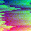

<div id="top"></div>


[![Contributors][contributors-shield]][contributors-url]
[![Forks][forks-shield]][forks-url]
[![Stargazers][stars-shield]][stars-url]
[![Issues][issues-shield]][issues-url]
[![GNU GPL License][license-shield]][license-url]


<!-- PROJECT LOGO -->
<br />
<div align="center">
  <a href="https://github.com/Westsi/silver-enigma">
    
  </a>

<h3 align="center">Silver-Enigma</h3>

  <p align="center">
    A pixel based manipulation and randomisation tool.
    <br />
    <a href="https://github.com/Westsi/silver-enigma"><strong>Explore the docs »</strong></a>
    <br />
    <br />
    <a href="https://github.com/Westsi/silver-enigma">View Demo</a>
    ·
    <a href="https://github.com/Westsi/silver-enigma/issues">Report Bug</a>
    ·
    <a href="https://github.com/Westsi/silver-enigma/issues">Request Feature</a>
  </p>
</div>


<!-- TABLE OF CONTENTS -->
<details>
  <summary>Table of Contents</summary>
  <ol>
    <li>
      <a href="#about-the-project">About The Project</a>
      <ul>
        <li><a href="#built-with">Built With</a></li>
      </ul>
    </li>
    <li>
      <a href="#getting-started">Getting Started</a>
      <ul>
        <li><a href="#prerequisites">Prerequisites</a></li>
        <li><a href="#installation">Installation</a></li>
      </ul>
    </li>
    <li><a href="#usage">Usage</a></li>
    <li><a href="#roadmap">Roadmap</a></li>
    <li><a href="#contributing">Contributing</a></li>
    <li><a href="#license">License</a></li>
    <li><a href="#contact">Contact</a></li>
    <li><a href="#acknowledgments">Acknowledgments</a></li>
  </ol>
</details>


<!-- ABOUT THE PROJECT -->
## About The Project
A image randomiser on the pixel level for banners and profile pictures. 


<p align="right">(<a href="#top">back to top</a>)</p>


### Built With

* [Python](https://python.org/)
* [Pillow](https://pillow.readthedocs.io/en/stable/)

<p align="right">(<a href="#top">back to top</a>)</p>


<!-- GETTING STARTED -->
<!--## Getting Started

This is an example of how you may give instructions on setting up your project locally.
To get a local copy up and running follow these simple example steps.

### Prerequisites

This is an example of how to list things you need to use the software and how to install them.
* npm
  ```sh
  npm install npm@latest -g
  ```

### Installation

1. Get a free API Key at [https://example.com](https://example.com)
2. Clone the repo
   ```sh
   git clone https://github.com/Westsi/thynkr.git
   ```
3. Install NPM packages
   ```sh
   npm install
   ```
4. Enter your API in `config.js`
   ```js
   const API_KEY = 'ENTER YOUR API';
   ```

<p align="right">(<a href="#top">back to top</a>)</p>

-->


<!-- USAGE EXAMPLES -->
## Usage


 


<p align="right">(<a href="#top">back to top</a>)</p>


<!-- ROADMAP -->
## Roadmap

- [ ] Image painting
- [ ] Other Patterns
- [ ] GUI
    - [ ] Multiple Image Save options

See the [open issues](https://github.com/Westsi/silver-enigma/issues) for a full list of proposed features (and known issues).

<p align="right">(<a href="#top">back to top</a>)</p>


<!-- CONTRIBUTING -->
## Contributing

Contributions are what make the open source community such an amazing place to learn, inspire, and create. Any contributions you make are **greatly appreciated**.

If you have a suggestion that would make this better, please fork the repo and create a pull request. You can also simply open an issue with the tag "help".
Don't forget to give the project a star! Thanks again!

1. Fork the Project
2. Create your Feature Branch (`git checkout -b feature/AmazingFeature`)
3. Commit your Changes (`git commit -m 'Add some AmazingFeature'`)
4. Push to the Branch (`git push origin feature/AmazingFeature`)
5. Open a Pull Request

<p align="right">(<a href="#top">back to top</a>)</p>


<!-- LICENSE -->
## License

Distributed under the GNU GPL License. See `LICENSE.txt` for more information.

<p align="right">(<a href="#top">back to top</a>)</p>


<!-- CONTACT -->
## Contact

Westsi - westsi@protonmail.com

Project Link: [https://github.com/Westsi/silver-enigma](https://github.com/Westsi/silver-enigma)

<p align="right">(<a href="#top">back to top</a>)</p>


<!-- ACKNOWLEDGMENTS -->
## Acknowledgments

* [Westsi](https://github.com/Westsi)
<p align="right">(<a href="#top">back to top</a>)</p>

[contributors-shield]: https://img.shields.io/github/contributors/Westsi/silver-enigma.svg?style=for-the-badge
[contributors-url]: https://github.com/Westsi/silver-enigma/graphs/contributors
[forks-shield]: https://img.shields.io/github/forks/Westsi/silver-enigma.svg?style=for-the-badge
[forks-url]: https://github.com/Westsi/silver-enigma/network/members
[stars-shield]: https://img.shields.io/github/stars/Westsi/silver-enigma.svg?style=for-the-badge
[stars-url]: https://github.com/Westsi/silver-enigma/stargazers
[issues-shield]: https://img.shields.io/github/issues/Westsi/silver-enigma.svg?style=for-the-badge
[issues-url]: https://github.com/Westsi/silver-enigma/issues
[license-shield]: https://img.shields.io/github/license/Westsi/silver-enigma.svg?style=for-the-badge
[license-url]: https://github.com/Westsi/silver-enigma/blob/master/LICENSE.txt
[product-screenshot]: demo/cool.png

